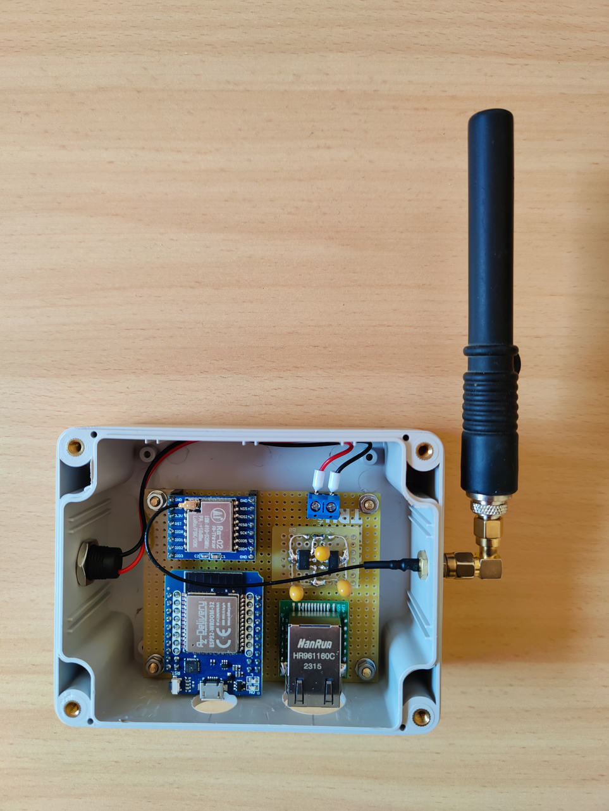
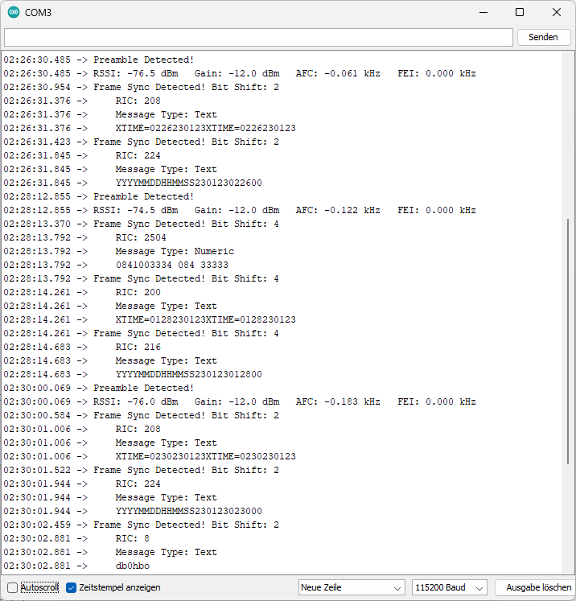

# pocsagGW
SX1278 and ESP32 based POCSAG gateway
#### Features
* uses Semtech SX1278 as FSK receiver
* also works with Semtech SX1276
* uses W5500 Ethernet transceiver
* works with EPS32 or ESP32-S3 (for example T-ETH-Lite with PoE)
* receives 1200 bps, 4500 Hz shift POCSAG messages
* serial console logging of received messages
* serial console Command Line Interface for configuration and debugging
* telnet server Command Line Interface for configuration and debugging
* 3 levels of debugging
* write/read configuration to/from flash
* german BOS mode and DAU filter
* german ASCII codes
* decoding of ROT1 encoded messages
* Ethernet based http gateway to forwarding the messages
* error correction by BCH decoding
### ESP32 GPIO
#### SX1278 (SPI)
* GPIO 12 - MISO
* GPIO 13 - MOSI
* GPIO 14 - SCLK
* GPIO 15 - CS
#### other SX1278 connections
* GPIO 25 - RESET
* GPIO 26 - DIO0
* GPIO 27 - DIO1
* GPIO 32 - DIO2
* GPIO 33 - DIO3 (for future development)
#### W5500 (SPI)
* GPIO 23 - MOSI
* GPIO 19 - MISO
* GPIO 18 - CLK
* GPIO  5 - CS
### ESP32-S3 (T-ETH-Lite with PoE) GPIO
#### SX1278 (SPI)
* GPIO 16 - MISO
* GPIO 15 - MOSI
* GPIO 17 - SCLK
* GPIO 18 - CS
#### other SX1278 connections
* GPIO 21 - RESET
* GPIO 38 - DIO0
* GPIO 39 - DIO1
* GPIO 40 - DIO2
* GPIO 41 - DIO3 (for future development)
#### W5500 (SPI)
* GPIO 12 - MOSI
* GPIO 11 - MISO
* GPIO 10 - CLK
* GPIO  9 - CS
#### Development Hardware

#### Console Screenshot (DAPNET DB0HBO)

#### Receiver Configuration
* center frequency in MHz and Rx error offset frequency in kHz
  * the Rx error offset is the measured AFC value when Rx error offset is set to 0
* bitrate in kbps (e.g. 1.2 for 1200 bps)
* frequency shift in kHz
  * this means the single sided shift (e.g. 4.5 for +/- 4500 Hz)
* Rx bandwidth in kHz (choose the next larger value from table in SX1278.h)
  * this means the single sided bandwidth
  * calculation: RXbandwidth >= Fshift+(bitrate/2)
  * the auto function uses the above formula
* AFC bandwidth in kHz (choose the next larger value from table in SX1278.h)
  * calculation: AFCbandwidth >= 2*(Fshift+(bitrate/2))+Ferror
  * Ferror means the maximum center frequency offset error of the SX1278 module
  * the auto function uses the above formula
